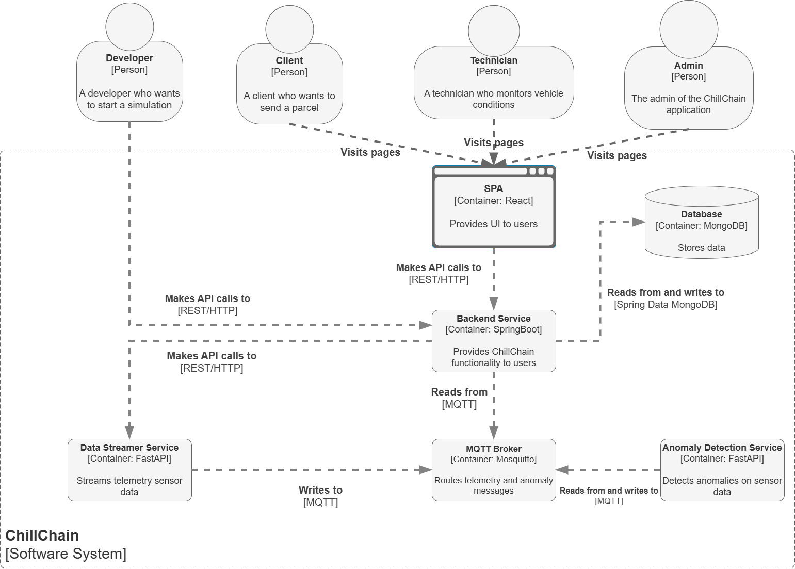

# ChillChain — Frontend Service

## A) Project Description

**ChillChain** is an IoT-integrated platform for refrigerated transport sharing. It combines two traditionally separate functionalities into a single system: a **logistics marketplace** for matching shipment demand with available transport capacity, and a **cold chain monitoring system** with real-time telemetry ingestion and ML-based anomaly detection.

The platform serves three user roles:

- **Admin** — manages the vehicle fleet, add technicians and check trips and shipments.
- **Technician** — monitors refrigeration telemetry dashboard and receives anomaly alerts generated by the ML pipeline.
- **Client** — books shipments on either dedicated or shared routes.

The system is fully containerized via Docker Compose for local deployment, comprising a React frontend, a Spring Boot backend, a MongoDB database, a Mosquitto MQTT broker, and two FastAPI microservices for telemetry simulation and anomaly detection.

---

## B) System Architecture



**Data flow:**

1. The **Data Streamer Service** reads refrigeration sensor data from CSV datasets and publishes it to MQTT topic `fridge/{vehicleName}/telemetry`.
2. The **Anomaly Detection Service** subscribes to the same topic, runs an LSTM autoencoder on incoming data, and publishes anomaly alerts to `fridge/{vehicleName}/anomalies`.
3. The **Backend Service** subscribes to both MQTT topics: it persists telemetry to MongoDB and converts anomaly messages into notification documents.
4. The **React Frontend SPA** consumes the REST API for all user interactions: authentication, fleet management, trip search and booking, telemetry dashboards, and notification management.

---

## C) Repository Links

| Component | Repository |
|-----------|-----------|
| **Project Presentation** (GitHub Pages) | [wot-project-2024-2025-presentation-Bello](https://github.com/UniSalento-IDALab-IoTCourse-2024-2025/wot-project-2024-2025-presentation-Bello.git) |
| **Frontend Service** (React + TypeScript) — *this repository* | [wot-project-2024-2025-frontend-service-Bello](https://github.com/UniSalento-IDALab-IoTCourse-2024-2025/wot-project-2024-2025-frontend-service-Bello) |
| **Backend Service** (Spring Boot) | [wot-project-2024-2025-spring-backend-service-Bello](https://github.com/UniSalento-IDALab-IoTCourse-2024-2025/wot-project-2024-2025-spring-backend-service-Bello) |
| **FastAPI Services** (Streamer + Anomaly Detector) | [wot-project-2024-2025-fast-api-service-Bello](https://github.com/UniSalento-IDALab-IoTCourse-2024-2025/wot-project-2024-2025-fast-api-service-Bello) |

---

## D) This Component: React Frontend

### Overview

The frontend is a single-page application built with React and TypeScript that provides the user interface for all three platform roles. It communicates with the Spring Boot backend via REST API calls authenticated with JWT tokens, and integrates Google Maps Platform for address autocomplete and route visualization.

### Tech Stack

| Layer | Technology |
|-------|-----------|
| Language & Framework | React 19 + TypeScript |
| Build Tool | Vite 6 |
| Styling | Tailwind CSS 3 — utility-first with custom indigo primary palette |
| Charts | Recharts 3 — line/area charts for telemetry dashboards |
| Routing | React Router v7 — client-side SPA routing |
| Maps | Google Maps JavaScript API (Places + Geometry libraries) — address autocomplete and route polyline rendering |

### Application Structure

The app is organized around a role-based navigation system managed in `App.tsx`. Authentication state and JWT tokens are stored in `localStorage`, and the user role determines which navigation links and pages are accessible.

#### Pages by Role

**Public (no login required):**

| Page | Component | Description |
|------|-----------|-------------|
| Home | `HomePage.tsx` | Landing page with platform overview and call-to-action |
| Send a Parcel | `SendParcel.tsx` | Multi-step shipment booking flow: address input with Google Places Autocomplete, parcel dimensions, trip search results (dedicated vs shared), and booking confirmation |
| Login | `LoginForm.tsx` | JWT authentication with role-based redirect |
| Register | `Register.tsx` | New client account registration |

**Admin (role: ADMIN):**

| Page | Component | Description |
|------|-----------|-------------|
| Add Vehicle | `AddVehicle.tsx` | Vehicle registration form with cargo dimensions (input in meters, stored in cm), weight, price/km, and refrigeration toggle |
| Vehicles | `VehicleList.tsx` | Fleet overview table with dimensions in meters, volume in m³, and cascade delete |
| Trips | `TripList.tsx` | Trip management with Google Maps route popup, shipment details per trip, and trip/shipment deletion |
| Add Technician | `AddTechnician.tsx` | Admin form to create technician accounts |

**Technician (role: TECHNICIAN):**

| Page | Component | Description |
|------|-----------|-------------|
| Vehicle Monitor | `VehicleMonitor.tsx` | Real-time telemetry dashboard with configurable time range, category filters (temperatures, pressures, performance, states), and per-sensor line charts via Recharts |
| Notifications | `Notifications.tsx` | Anomaly alert inbox with read/unread filtering and mark-as-read functionality |
| Reports | `Reports.tsx` | Operating hours and anomaly alert reports per vehicle |

**Client (role: CLIENT):**

| Page | Component | Description |
|------|-----------|-------------|
| My Shipments | `ClientShipments.tsx` | List of the client's booked shipments with status and trip details |

---


## E) Running the Service

As part of the full Docker Compose stack:

```bash
docker compose up -d
```

For standalone development (requires the Spring Boot backend running on `http://localhost:8081`):

```bash
npm install
npm run dev
```

The dev server starts on `http://localhost:5173`.

### Docker Hub

The production image is published on Docker Hub: `antoniobello09/chillchain-frontend`

**Pull and run:**

```bash
docker pull antoniobello09/chillchain-frontend:latest
docker run -d -p 5173:80 --name chillchain-frontend antoniobello09/chillchain-frontend:latest
```

The app will be available at `http://localhost:5173`.

**Build and push** (requires the API key at build time, as it is embedded in the JS bundle by Vite):

```bash
docker build --build-arg VITE_GOOGLE_MAPS_API_KEY=<your-api-key> -t antoniobello09/chillchain-frontend:latest .
docker push antoniobello09/chillchain-frontend:latest
```

---

## G) Build

```bash
npm run build
```

Produces a static bundle in `dist/` ready for deployment behind any web server (Nginx, etc.).

---

## H) Environment Variables

Create a `.env` file in the project root before running or building:

| Variable | Description |
|----------|-------------|
| `VITE_GOOGLE_MAPS_API_KEY` | Google Maps Platform API key — required for address autocomplete (Places API) and route map rendering (Maps JavaScript API + Geometry library) |

Example `.env`:

```
VITE_GOOGLE_MAPS_API_KEY=your_api_key_here
```

The key is injected into `index.html` at build time via Vite's `%VITE_*%` syntax. The `.env` file is excluded from version control (see `.gitignore`). A `.env.example` template should be committed in its place.
